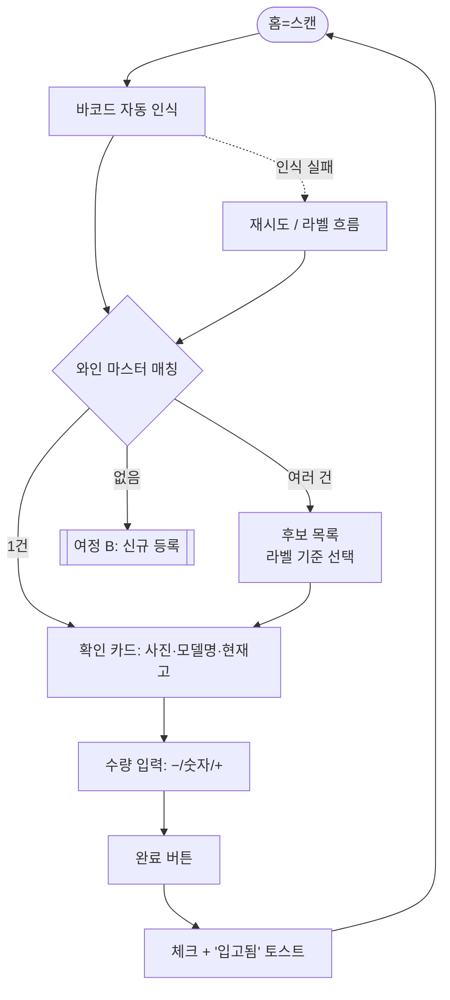
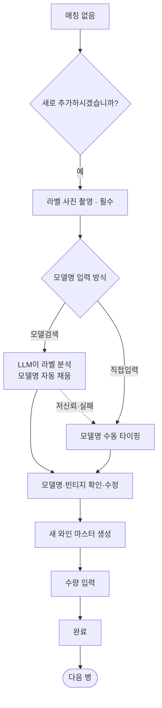
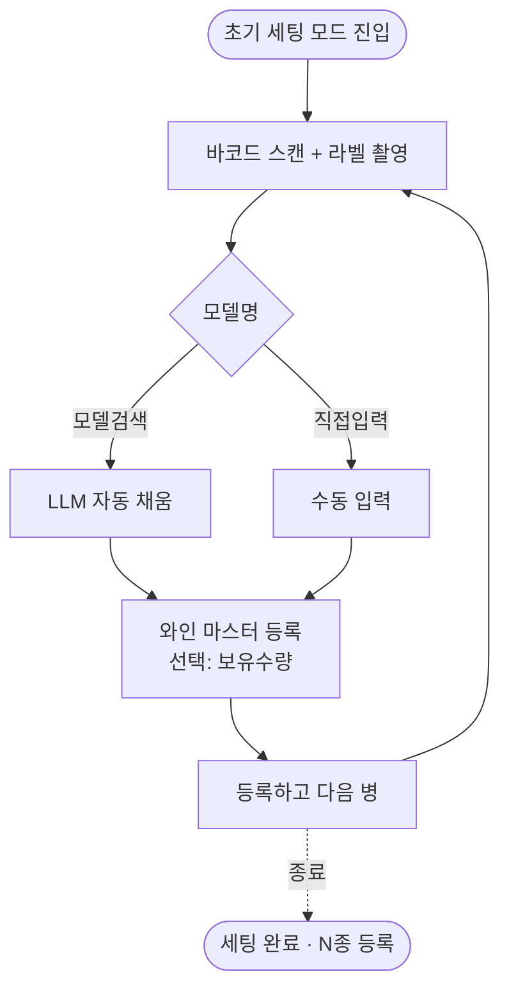
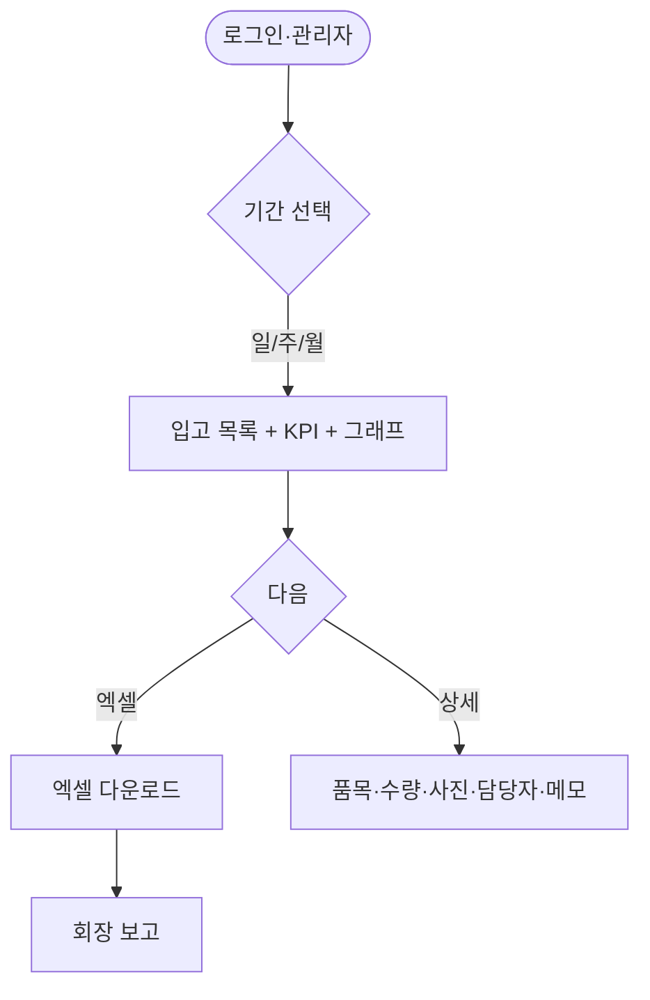

# UX Design Specification wineerp

**Author:** HEMICOLON
**Date:** 2026-07-16

---

<!-- UX design content will be appended sequentially through collaborative workflow steps -->

## Executive Summary

### Project Vision

wineerp는 현장 직원이 스마트폰으로 바코드를 스캔하고 라벨을 촬영하면, 사전 구축된 와인 마스터 DB와 매칭해 모델명·빈티지·사진을 자동으로 띄우고 수량만 입력하면 입고가 끝나는 모바일 우선 재고관리 서비스다. 명세서(부정확한 텍스트)가 아니라 실물(바코드·라벨)을 기준으로 품목을 확정해 검수·입력 시간을 절반으로 줄인다. 관리자는 같은 앱에서 일/주/월 집계를 보고 그래프·엑셀로 회장/오너에게 보고한다.

### Target Users

- **직원(현장 검수 담당자) — 주 사용자.** 트럭·창고 앞에서 한 번에 1~100병(그날그날 다름)을 한 손으로 연속 처리. 속도와 오조작 방지가 생명. "찍고 → 수량 → 완료 → 다음 병" 리듬.
- **관리자.** 직원의 모든 기능 + 조회·리포트. 현장에서 모바일로 집계를 확인하고 엑셀·그래프로 보고.

### Key Design Challenges

1. **가변적 연속 입고.** 한 세션에 몇 병이 들어올지 미리 알 수 없다(1~100). 병 단위로 식별→수량→명시적 "완료"로 한 건을 확정하고 즉시 다음 병으로. 묶음/배치 전제 금지.
2. **입고 후 수정.** 잘못 넣은 수량·품목은 입고 내역(목록) 화면에서 다시 열어 수정한다(FR-8).
3. **빈티지 후보 선택(OQ-2).** 같은 바코드에 연식이 여러 개일 때 라벨 사진 기준으로 빠르게 고른다. 바코드가 빈티지를 못 나눌 수 있다는 미검증 리스크를 UI가 흡수한다.
4. **LLM 신규 등록 대기(3~5초).** 라벨→모델명 추론 중 흐름이 끊기지 않게 대기·수정·수동 폴백을 매끄럽게.
5. **확인 습관 유지(SM-C2).** 자동 채움을 맹신해 오등록하지 않도록 확인을 자연스럽게 유도.

### Design Opportunities

- **카드형 즉시 확인.** 스캔 즉시 "샤토 XXX 2019 · 재고 12" 카드로 심리적 확신 + 속도.
- **회장 보고용 리포트.** "한눈에 보이는 그림"이 POC 데모의 임팩트 산출물 — 그래프 완성도가 세일즈 포인트.
- **톤앤매너.** 딥 네이비 헤더 + 밝은(화이트/쿨 그레이) 배경, 둥근 카드, 병 사진이 주인공. 감각 카테고리별 컬러 바(네이비·마룬·골드) 같은 명료한 정보 색. 깔끔·미니멀·**고시인성(큰 글씨)**. 한국인 정서에 맞춘 실사용 도구. (레퍼런스: YOURNOTES 스타일)

### Platform

- **직원 앱:** 안드로이드 폰 우선(크로스 플랫폼 지향). 한 손 세로 조작 최적화.
- **관리자:** 모바일 우선(현장 검수 병행). 웹 병행은 본 제품 단계 재검토.

## Core User Experience

### Defining Experience
직원의 앱 사용 대부분을 차지하는 정의적 루프: 카메라 조준 → 바코드 자동 인식 → (분기) → 확인/입력 화면 → 수량 입력 → [완료] → 다음 병. 한 병을 몇 초에 끝내느냐가 제품 가치를 결정한다.

스캔 결과 분기:
- **모델 있음(매칭):** 라벨 사진 + 모델명 + 현재고를 표시하고 수량 입력 화면으로. (같은 바코드에 여러 모델이 저장돼 있으면 후보 목록에서 먼저 선택 후 동일하게 진행.)
- **모델 없음(미매칭):** 라벨 사진을 먼저 촬영(필수) → [모델검색] 또는 [직접입력] → 수량 입력.

수량은 1~100으로 가변이며, 병마다 명시적 "완료"로 확정한다.

### Platform Strategy
안드로이드 폰 우선, 세로·한 손 조작. 하단 엄지 영역에 수량·완료 등 핵심 액션 배치. 카메라(바코드/라벨)가 1급 시민. 온라인 필수(서버 매칭·LLM 추론), POC는 오프라인 미지원. 태블릿·iOS·웹 병행은 본 제품 단계 재검토.

### Effortless Interactions
- 바코드 자동 인식(셔터 없이 조준만).
- 매칭 시 사진·모델명·현재고 즉시 표시 → 곧바로 수량 입력.
- 매칭이 여러 건이면 목록 탭 한 번으로 선택.
- 수량은 숫자 직접 입력 + [−]/[+] 버튼으로 한 손 조정.
- 미매칭 신규 등록:
  - 라벨 사진 촬영(필수, 기록·유추 공용 소스).
  - [모델검색] → 그 라벨 사진으로 LLM이 모델명 유추 → 모델명 란 자동 채움 → 확인·수정.
  - [직접입력] → 모델명 수동 타이핑(유추가 불필요·부정확할 때의 즉시 폴백).

### Critical Success Moments
- 첫 스캔에 카드가 즉시 뜨는 순간("이게 낫다"의 체감).
- 완료 → 다음 병으로 끊김 없이 이어지는 순간(100병도 가능하다는 확신).
- 신규 와인도 라벨 한 장으로 이름이 채워지는 순간(긴 와인명 타이핑 회피).
- 실패 시 치명: 인식 지연/멈춤, 잘못된 품목 확정, 완료 후 수정 불가.

### Experience Principles
1. 실물이 진실이다 — 명세서가 아니라 바코드·라벨로 확정.
2. 한 손, 최소 탭 — 병 1건을 엄지만으로.
3. 자동으로 채우되, 사람이 확정한다 — 매칭·LLM은 초안, 직원의 눈이 최종(SM-C2).
4. 끊기지 않는 리듬 — 대기·오류·신규등록도 흐름 안에서 흡수.
5. 틀려도 되돌릴 수 있다 — 완료 후에도 내역에서 수정 가능(FR-8).
6. 자동은 강요하지 않는다 — LLM 모델검색과 직접입력을 항상 나란히 제공.

## Desired Emotional Response

### Primary Emotional Goals
- 직원: 통제감 + 리듬감(flow). 100병 앞에서도 압도되지 않고 "빠르고 정확하게 처리 중"이라는 감각.
- 관리자: 명료함 + 보고 자신감. 한 화면에서 상황 파악, 회장 앞에서 "이 그림이면 됐다".
- 공통 정서: 화려함이 아니라 "믿고 빠르게, 실수 걱정 없이"의 신뢰.

### Emotional Journey Mapping
- 첫 스캔: "바로 뜨네" — 가벼운 놀라움 + 신뢰.
- 연속 입고: 몰입·리듬 — 생각 없이 손이 움직임.
- 신규 등록: 안도 — 긴 와인명을 타이핑하지 않아도 채워짐.
- 실수 시: 안심 — 내역에서 고치면 된다는 확신, 당황 없음.
- 리포트: 뿌듯함·통제감 — 한눈에 보이는 그림.

### Micro-Emotions
- 확신 > 혼란: 무엇이 확정됐는지 항상 분명.
- 신뢰 > 의심: 자동 채움 값도 확인·수정 가능하다는 안전감.
- 성취 > 좌절: 완료 순간의 명확한 피드백.
- 차분함 > 불안: LLM 대기·오류에도 흐름이 무너지지 않음.

### Design Implications
- 통제감 → 스캔 즉시 확인 카드 + 명시적 "완료" 버튼.
- 안심 → 완료 후에도 내역에서 수정 가능, 되돌리기 용이.
- 차분함 → LLM 대기 시 명확한 진행 표시 + 항상 [직접입력] 폴백.
- 신뢰 → 자동 채운 값을 "수정 가능"하게 시각화(맹신 방지, SM-C2).
- 뿌듯함 → 리포트는 깔끔한 마젠타 톤 그래프로 보고 임팩트 확보.

### Emotional Design Principles
1. 압도하지 않는다 — 한 번에 한 병, 한 화면에 한 결정.
2. 항상 되돌릴 수 있다 — 실수의 공포를 제거해 속도를 높인다.
3. 자동은 신뢰하되 확인은 사람이 — 안전감과 정확성을 동시에.
4. 대기조차 차분하게 — 진행 상태를 숨기지 않는다.
5. 피해야 할 감정: 불안·좌절·불신·압도.

## UX Pattern Analysis & Inspiration

### Inspiring Products Analysis
- 토스/뱅크샐러드류: 큰 숫자·1화면 1결정·부드러운 카드 → 명료·차분한 감성.
- 카카오/네이버 바코드 스캐너: 조준 자동 인식, 셔터 최소화 → 연속 스캔 리듬.
- 배민/쿠팡 수량 스테퍼: [−]/[+] + 숫자 직접 입력 → 수량 UI 차용.
- 레퍼런스(YOURNOTES 스타일): 딥 네이비 헤더 + 화이트 배경 + 큰 병 사진 + 큰 점수 타이포 + 감각 카테고리 컬러 바(네이비·마룬·골드) → 톤앤매너·정보 위계.

### Transferable UX Patterns
- 하단 고정 1급 액션("완료")을 엄지 영역에 크게.
- 풀스크린 카메라 + 조준 프레임, 인식 즉시 하단 확인 카드 슬라이드업.
- 결과 카드: 병 사진 + 모델명·빈티지·현재고를 큰 타이포로.
- 후보 목록: 사진 썸네일 세로 카드 리스트, 한 탭 선택.
- 인라인 편집: 자동 채운 모델명을 탭해 즉시 수정.

### Anti-Patterns to Avoid
- 연속 스캔마다 확인 모달(리듬 파괴).
- 작은 터치 타깃(최소 48dp, 충분한 여백).
- LLM 대기 중 빈 화면/멈춘 스피너(진행 표시 + [직접입력] 상시 노출).
- 깊은 메뉴 계층(조회·리포트는 2탭 이내).
- 저대비 장식 위주(현장 조명에서 가독성 우선).

### Design Inspiration Strategy
- Adopt: 자동 인식 스캐너, [−]/[+]+숫자 스테퍼, 하단 고정 완료 버튼, 네이비/화이트 톤 카드, 큰 글씨.
- Adapt: 커머스 상세 카드 → 입고 확인 카드(가격 대신 현재고·빈티지); 검색 UI → 모델검색(LLM).
- Avoid: 스캔마다 모달, 소형 타깃, 대기 중 빈 화면, 깊은 계층.

## Design System Foundation

### 1.1 Design System Choice
Material 3(Flutter 기본)을 기반으로 채택하고, 딥 네이비 시드 컬러 + 감각 카테고리 컬러(마룬·골드)로 테마를 커스텀하는 Themeable 방식. (스택은 아키텍처 단계에서 최종 확정.)

### Rationale for Selection
- 속도: Flutter 기본 Material 3 컴포넌트로 POC 일정에 맞춤(스캐너·리스트·스테퍼·다이얼로그 즉시 사용).
- 안드로이드 우선: 사용자에게 익숙한 컴포넌트·제스처.
- 브랜드: 테마(색·형태·타이포)로 와인 커머스 톤 확보, 차별화는 색·촬영 UX로.
- 접근성: 고대비·48dp 터치 타깃 등 기본 준수 → 현장 환경 유리.

### Implementation Approach
- Flutter + Material 3 컴포넌트를 기본으로 사용.
- ColorScheme.fromSeed(딥 네이비) + 화이트/쿨 그레이 라이트 배경.
- 큰 라운드 카드, 딥 네이비 상단 헤더, 하단 고정 큰 "완료" 버튼, **시인성 우선 큰 타이포**(모델명·수량·현재고).
- 한글 가독성 폰트 적용(후보: Pretendard/Noto Sans KR, 아키텍처 확정).

### Customization Strategy
- 컬러: seed=딥 네이비, 화이트 배경 + 네이비 강조. 감각 카테고리 컬러 바(네이비·마룬·골드)로 정보 위계. 다크모드는 본 제품 단계.
- 커스텀 컴포넌트(소수): 스캐너 오버레이(조준 프레임), 입고 확인 카드, 수량 스테퍼([−]/숫자/[+]).
- 나머지는 Material 기본을 최대 활용해 개발·유지보수 부담 최소화.

## 2. Core User Experience

### 2.1 Defining Experience
"찍으면 뜬다(Scan-to-Card)". 병 바코드를 조준하면 자동 인식되어 즉시 확인 카드(사진·모델명·빈티지·현재고)가 뜨고, 수량만 넣고 [완료]하면 한 건이 끝난다. 이 상호작용이 제품의 핵심이며 나머지(신규등록·조회·리포트)는 여기서 파생된다.

### 2.2 User Mental Model
- 현재: 명세서 종이와 병을 눈으로 대조, 부정확한 이름과 씨름하며 수기 입력(느리고 오입력).
- 기대: 카메라로 비추면 알아서 인식(QR·번호판 인식 같은 즉시성).
- 혼란 지점: 같은 바코드에 빈티지 복수일 때 선택, 신규일 때 긴 와인명 타이핑 부담.

### 2.3 Success Criteria
- 스캔 → 카드 표시 2초 이내.
- 매칭 시 타이핑 0(수량만 입력).
- 완료 시 명확한 피드백 + 다음 병으로 자동 복귀.
- 신규도 라벨 1장으로 모델명 자동 채움(긴 타이핑 회피).

### 2.4 Novel UX Patterns
- 대부분 익숙한 패턴 조합: 카메라 스캐너 + 수량 스테퍼 + 상세 카드 → 학습 불필요.
- 고유 트위스트: 미매칭 시 "라벨 촬영 → LLM 모델검색"이 입고 흐름 안에 자연스럽게 통합.

### 2.5 Experience Mechanics
1. 시작: 홈=카메라 스캔. 조준 프레임에 바코드를 대면 자동 인식(셔터 없음).
2. 상호작용:
   - 매칭 1건 → 하단 확인 카드 슬라이드업.
   - 매칭 복수 → 썸네일 후보 리스트에서 한 탭 선택.
   - 미매칭 → "새로 추가?" → 라벨 촬영(필수) → [모델검색](LLM 자동 채움)/[직접입력] → 확인 카드.
   - 수량 → [−]/숫자/[+] 스테퍼.
3. 피드백: 인식 시 햅틱 + 카드 등장. LLM 대기 중 진행 표시 + [직접입력] 상시. 오선택 즉시 취소/재선택.
4. 완료: 하단 고정 [완료] → 체크 애니메이션 + "입고됨" 토스트 → 카메라 자동 복귀. 방금 건은 내역에서 수정 가능.

## Visual Design Foundation

> 톤앤매너 v2 — 레퍼런스를 마젠타(와인 커머스)에서 **네이비+화이트(YOURNOTES 스타일)** 로 변경. 글씨는 시인성 우선으로 크게. 라이브 프리뷰: wineerp 컬러 시스템 아티팩트.

### Color System
레퍼런스(YOURNOTES 스타일: 딥 네이비 헤더 + 화이트 배경 + 큰 타이포 + 감각 카테고리 컬러 바) 기반, Material 3 시맨틱 매핑.
- Primary(딥 네이비) #123E7C: 헤더·주요 액션·[완료] 버튼. (on White 9.4:1)
- Primary Strong(블루) #1766B0: 점수·강조 숫자·링크·차트. (on White 4.9:1)
- Primary Container #E4ECF7: 현재고 배지·선택 칩·강조 배경.
- Category 컬러 바 — 네이비 #123E7C(식별) / 마룬 #9B1B1B(라벨·사진) / 골드 #B8860B(재고·입고): 정보 위계 표시 장치.
- Background #F6F7F9(쿨 그레이 틴트) / Surface #FFFFFF.
- On-Surface #1A1D21(고대비 본문·모델명) / Muted #7B828C.
- Success #2E7D53(입고 완료) / Warning #B8860B(LLM 저신뢰) / Error #D32F2F(인식 실패·중복).
- 다크모드는 본 제품 단계. 상태색은 아이콘 병기(색맹 고려).

### Typography System
- 폰트: Pretendard(1순위)/Noto Sans KR.
- **시인성 우선(큰 글씨)** 스케일: Display 34 / H1 28 / H2 22 / 모델명 22 semibold~bold / Body 17 / 수량 34 bold / Caption 14.
- 모델명·수량·현재고·점수는 크게, 부가정보는 Muted로 위계.

### Spacing & Layout Foundation
- 기준 8dp(4dp 반보조). 카드 라운드 16dp, 버튼 라운드 12dp.
- 터치 타깃 최소 48dp(권장 50dp), 하단 [완료] 58dp 풀폭.
- 상단 딥 네이비 헤더 밴드, 단일 컬럼 세로 스크롤, 카메라는 풀블리드. 카드 간격 12~14dp(오조작 방지 여유).
- 섹션/정보 그룹은 좌측 컬러 바(네이비·마룬·골드)로 구분(YOURNOTES 장치 차용).

### Accessibility Considerations
- 텍스트 대비 WCAG AA(4.5:1) 이상(Primary Navy on White ≈ 9.4:1, Blue ≈ 4.9:1).
- 색만으로 상태 전달 금지 → 아이콘·라벨 병기.
- 현장 밝은 조명 대비·큰 터치 타깃·시인성 우선 큰 폰트.

## Design Direction Decision

### Design Directions Explored
톤앤매너(네이비 v2)가 이미 확정되어, 발산형 시안 대신 확정 방향을 실제 입고 흐름 7개 핵심 화면에 적용한 목업 세트를 제작(ux-design-directions 프리뷰). 화면: 홈·스캔 / 입고 확인 카드 / 후보 선택 / 신규 등록 / 초기 세팅(FR-13) / 입고 내역·수정 / 리포트.

### Chosen Direction
- 딥 네이비 상단 헤더 + 화이트 배경 + 큰 글씨(시인성) + 카테고리 컬러 바.
- 하단 4탭 내비(스캔·내역·리포트·재고), 홈=스캔.
- 입고 확인은 카드형(사진+모델명+현재고) + [−]/숫자/[+] 스테퍼 + 하단 고정 [완료].
- 신규/초기세팅은 라벨 촬영 → AI 추론 필드(파란 강조)/직접입력.
- 초기 세팅(FR-13)은 골드 강조로 입고와 시각 구분, 연속 등록 리듬.
- 리포트는 기간 세그먼트 + KPI + 막대 그래프 + 엑셀.

### Design Rationale
- 확정 비주얼 파운데이션과 100% 정합(개발·유지보수 일관성).
- Scan-to-Card 경험 원칙(속도·최소탭·되돌리기)을 화면 배치로 구현.
- FR-13을 색으로 구분해 두 모드(입고/초기세팅) 혼동 방지.

### Implementation Approach
- Flutter Material 3 컴포넌트 + 네이비 시드 테마로 각 화면 구성.
- 커스텀: 스캐너 오버레이, 확인 카드, 수량 스테퍼, AI 추론 필드, 카테고리 컬러 바.

## User Journey Flows

### 여정 A — 아는 와인 입고 (UJ-1, 매칭)

### 여정 B — 신규 와인 등록 (UJ-2 / FR-6, 미매칭)

### 여정 C — 초기 재고 세팅 (FR-13, 연속 등록)

### 여정 D — 관리자 리포트·보고 (UJ-3)

### Journey Patterns
- 내비게이션: 홈=스캔 고정. 완료 후 항상 스캔으로 자동 복귀(연속 리듬).
- 결정 패턴: 분기는 항상 "자동 우선 + 수동 폴백"(모델검색↔직접입력). 강요 없음.
- 피드백 패턴: 인식=햅틱, 완료=체크+토스트, 대기=진행 표시+폴백 노출, 오류=명확한 사유+복구 액션.
- 되돌리기: 완료된 건은 내역에서 수정(공포 제거).

### Flow Optimization Principles
- 매칭 성공 경로는 탭 2회 이내(수량→완료)로 최단화.
- 미매칭도 라벨 1장으로 이름 확보 → 타이핑 최소.
- 입고/초기세팅 모드 분리로 혼동·오등록 방지(색·CTA 구분).
- 모든 대기(LLM)에 폴백 상시 노출로 흐름 정지 방지.

## Component Strategy

### Design System Components
Material 3 기본 활용: Scaffold, AppBar(네이비 헤더), NavigationBar(하단 4탭), Card, ListTile, FilledButton/OutlinedButton, SegmentedButton(일·주·월), TextField(모델명·빈티지·메모), SnackBar(입고됨 토스트), CircularProgressIndicator(LLM 대기), Chip(현재고·태그), Dialog("새로 추가?").

### Custom Components
- ScannerOverlay: 풀블리드 카메라 + 조준 프레임(골드 코너·레이저). 상태: 조준/인식성공(햅틱)/실패.
- ReceivingConfirmCard: 병 사진·모델명(22)·빈티지·현재고 배지. 상태: 매칭1건/로딩/취소·재선택.
- QuantityStepper: [−]/숫자(34)/[+] + 키패드. 상태: 기본/최소(1) −비활성/직접입력.
- CandidateList: 빈티지 후보 썸네일 세로 카드. 상태: 미선택/선택됨(네이비 하이라이트).
- AiInferenceField: 모델명 필드 + "AI 추론" 태그(파란 강조) + 인라인 수정. 상태: 추론중/완료/저신뢰(경고)/수동.
- CategoryBar: 정보 그룹 좌측 컬러 바(네이비·마룬·골드).
- SetupModeBanner: 초기 세팅 모드 표시(골드) + 등록 카운터.
- ReportBarChart: 기간별 입고 막대(피크 골드). 상태: 데이터/빈 상태.
- HistoryRow: 사진·모델명·시간·담당·메모·수량·수정 진입. 상태: 기본/메모있음/수정중.
- 접근성: 인터랙티브 48dp+, semantic 라벨, 색+아이콘 병기, 포커스 가시화.

### Component Implementation Strategy
- 커스텀 컴포넌트는 네이비 시드 테마의 디자인 토큰(색·라운드·타이포)으로 제작해 Material과 일관.
- 재사용 우선: CategoryBar·QuantityStepper·AiInferenceField는 여러 화면에서 공유.
- 나머지는 Material 기본 최대 활용으로 개발·유지보수 최소화.

### Implementation Roadmap
- Phase 1(핵심 입고 루프): ScannerOverlay, ReceivingConfirmCard, QuantityStepper, CandidateList → 여정 A/B.
- Phase 2(신규·초기세팅): AiInferenceField, SetupModeBanner → 여정 B/C.
- Phase 3(조회·보고): HistoryRow, ReportBarChart, CategoryBar → 여정 D + 내역.

## UX Consistency Patterns

### Button Hierarchy
- Primary(화면당 1개): 네이비 채움, 하단 고정 풀폭 56~58dp([완료]·[확인하고 수량 입력]·[이 와인으로 선택]).
- 초기 세팅 Primary: 골드 채움([등록하고 다음 병]) — 모드 구분.
- Secondary: 네이비 아웃라인([엑셀 다운로드]·[직접입력]).
- Tertiary/링크: 파란 텍스트([직접입력] 대기중·[수정]).
- 규칙: 화면당 Primary 하나, 파괴적 액션만 Error색.

### Feedback Patterns
- 성공: SnackBar(그린)+체크+햅틱("입고됨").
- 대기: 인라인 진행 표시 + 폴백 링크 상시, 전체 차단 모달 금지.
- 경고: 골드 인라인 배지("추론 신뢰도 낮음·확인").
- 오류: Error 인라인 + 복구 액션("인식 실패·다시 스캔"), 사과문구 없이 사유+해결.
- 색만으로 전달 금지 → 아이콘·라벨 병기.

### Form Patterns
- 라벨 항상 표시(placeholder 대체 금지), 입력 타깃 48dp+.
- AI 추론 값 = 파란 태그 + 수정 가능 표시(맹신 방지, SM-C2), 저장 시 검증.
- 수량은 스테퍼 기본 + 탭하면 키패드 직접입력, 최소 1(− 비활성).
- 필수/선택 명시: 라벨 사진=필수, 메모=선택.

### Navigation Patterns
- 하단 4탭 고정(스캔·내역·리포트·재고), 홈=스캔.
- 뒤로가기=상단 좌측 ‹, 완료 후 스캔 자동 복귀.
- 초기 세팅은 별도 모드(배너 진입 표시·명확한 나가기).

### Additional Patterns
- 빈 상태: 안내 문구 + 시작 액션("스캔으로 시작").
- 로딩: 리스트=스켈레톤, 단건=인라인 스피너, 빈 화면 금지.
- 리스트: 카드형 + 좌측 CategoryBar 색 그룹 + 우측 수량 강조·수정 진입.
- 파괴적 확인: 삭제/큰 수량 변경만 확인 다이얼로그, 일반 흐름 모달 최소.

## Responsive Design & Accessibility

### Responsive Strategy
- 주 대상: 안드로이드 폰 세로(360~430dp), 단일 컬럼 고정.
- 작은 폰(≤360dp): 패딩·간격 축소, 모델명 최소 20 유지, 하단 [완료] 고정 노출.
- 큰 폰/폴더블(≥600dp): 리스트·리포트 최대 폭 제한 + 중앙 정렬, 입고 루프는 단일 컬럼.
- 태블릿: 본 제품 단계에서 2단(내역+상세) 검토, POC 비대상.
- 가로 모드: 스캔 화면만 대응, 입력은 세로 권장.

### Foldable (Galaxy Fold) 대응
폴드 사용자는 커버(전면)·메인(펼침) 해상도·종횡비가 극단적으로 달라 반드시 대응.

- **해상도 파악(Galaxy Z Fold 6 기준):**
  - 커버(전면·접힘): 2376×968px, 410ppi → 약 **378×927dp**, 종횡비 22.1:9(극세로). 브레이크포인트 Compact.
  - 메인(펼침): 2160×1856px, 374ppi → 약 **794×924dp**, 종횡비 ~20:17(거의 정사각). Medium/Expanded.
  - 구형 Galaxy Fold 커버는 더 좁음 → **안전 최소폭 280dp** 기준으로 설계.
- **커버(Compact, 280~430dp):** 단일 컬럼 유지, 가로 스크롤 절대 금지. 스캐너 조준 프레임·확인 카드가 좁은 폭에 맞게 축소. 하단 [완료]는 극세로에서도 항상 도달 가능하게 고정. 최소폭 280dp에서 레이아웃 무결.
- **메인(Medium/Expanded, ~794dp 정사각):** 단일 컬럼 최대 폭 제한(가독 라인) + 중앙 정렬, 또는 2-pane(내역 리스트+상세)로 남는 폭 활용. 입고 루프(스캔·확인)는 혼란 방지 위해 단일 컬럼 중앙 유지.
- **폴드 상태 전환(Continuity):** resizeableActivity=true, 접기/펴기=구성 변경으로 처리하되 진행 중 입고·스캔 상태 보존(no data loss), 카메라 세션 재바인딩.
- **테스트:** 커버(22:9)·메인(~1:1) 양극단 + 전환 시나리오를 에뮬레이터/실기(Fold)로 검증.

### Breakpoint Strategy
- Compact ≤600dp(폰·폴드 커버, 최소 280dp) / Medium 600~840dp(큰 폰·폴드 메인) / Expanded ≥840dp(태블릿, 향후).
- 상대 단위(dp/%/flex) 사용, 고정 px 지양. OS 글꼴 크기 설정 존중.

### Accessibility Strategy (목표: WCAG 2.1 AA)
- 대비: 본문 4.5:1+(네이비 on White 9.4:1), 큰 텍스트 3:1+.
- 터치 타깃 최소 48dp(권장 50dp), 간격 8dp+.
- 상태는 색+아이콘 병기(색만 전달 금지).
- 스크린리더(TalkBack): 스캔·스테퍼 ±·완료·AI 추론 필드 semantic 라벨, 카메라 대체 안내.
- OS 글꼴 확대 대응, reduce motion 시 애니메이션 최소.
- 현장 특수: 밝은 조명 고대비, 한 손·장갑 큰 타깃, 소음 대비 햅틱+시각 이중 피드백.

### Testing Strategy
- 기기: 실제 안드로이드 폰(저가·고가), 갤럭시 폴드(커버·메인·전환), 작은/큰 화면, 야외 밝은 조명 스캔 검증.
- 접근성: TalkBack 내비, Accessibility Scanner 대비검사, 색맹 시뮬레이션, 글꼴 200% 확대.
- 성능: 스캔→카드 2초 이내, LLM 추론 3~5초 대기 UX 검증.

### Implementation Guidelines
- Flutter: MediaQuery/LayoutBuilder로 Compact/Medium/Expanded 분기, 상대 단위·Flexible. 최소폭 280dp 무결.
- 하단 [완료]는 고정 영역으로 스크롤 무관 노출.
- resizeableActivity=true + 상태 보존으로 폴드 전환 대응.
- Semantics 위젯으로 라벨·상태 제공, 최소 48dp 보장.
- 라벨 이미지 압축 업로드로 LLM 지연·비용 최적화.
- OS 텍스트 스케일 대응(textScaler 클램프), 애니메이션 감소 설정 존중.
